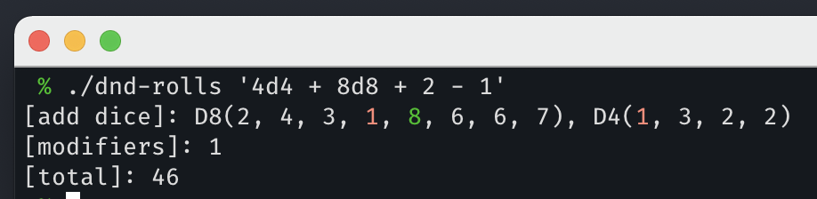

# D&D Rolls

D&D Rolls is a program for rolling D&D dice. Give it a string and it will convert it to dice and roll them.

```bash
> ./dnd-rolls '4d8 + d6 - 1d4 - 1'
# Sample output
[add dice]: D6(4), D8(6, 3, 2, 5)
[sub dice]: D4(3)
[modifiers]: -1
[total]: 16
```

The program can handle:

- Single dice of any type (`D4`, `D6`, `D20`, even `D11`!)
- Multiple dice at once (`4D4`, `10D8`)
- Modifiers e.g. (`D20 - 1`)

CLI output is also colorized for high and low rolls



## Build program & run tests

The program is built and tested using cargo

```bash
cargo build
cargo test
```
